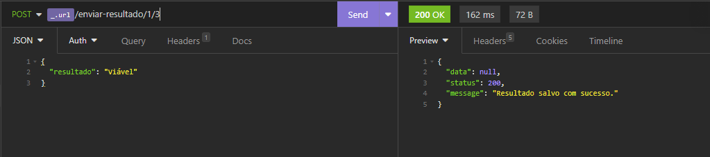
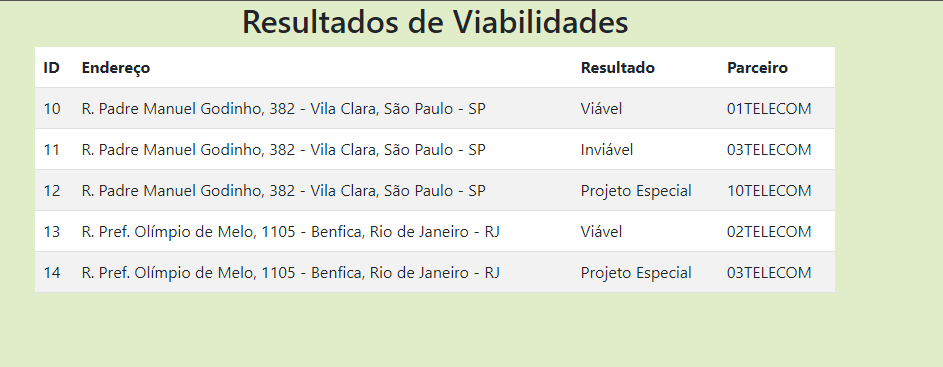

# Desafio Full Stack

Este repositório contém o código fonte utilizado em um desafio. A descrição se encontra no arquivo [Desafio full-stack Oi Soluções](https://github.com/kayanerocha/desafio-fullstack/blob/main/documentacao/Desafio%20full-stack%20Oi%20Solu%C3%A7%C3%B5es.pdf)


## Variáveis de Ambiente

Para rodar esse projeto, você vai precisar adicionar as seguintes variáveis de ambiente no seu .env

`MYSQL_HOST`

`MYSQL_USER`

`MYSQL_PASSWORD`

`MYSQL_PORT`


## Rodando Localmente a API

Clone o projeto

```bash
  git clone https://github.com/kayanerocha/desafio-fullstack.git
```

Entre no diretório da API

```bash
  cd desafio-fullstack/api
```

Execute os seguintes arquivos `.sql` de preferência no MySQL Workbench

```bash
  db/cotacao.sql
  db/carga.sql
```

Crie o ambiente virtual

```bash
  python -m venv .venv
```

Ative o ambiente virtual

```bash
  .venv\Scripts\activate
```

Instale as bibliotecas

```bash
  pip install -r requirements.txt
```

Rode a API

```bash
  python cotacao.py
```

Abra o seguinte arquivo no navegador

```bash
  frontend/index.html
```


## Documentação da API

#### Retorna todos os resultados

```http
  GET /
```

#### Um parceiro responde a uma viabilidade

```http
  POST /enviar-resultado/<id_viabilidade>/<id_parceiro>
```

| Parâmetro   | Tipo       | Descrição                                   |
| :---------- | :--------- | :------------------------------------------ |
| `id_viabilidade`      | `int` | **Obrigatório**. O ID da viabilidade a ser respondida. |
| `id_parceiro`      | `int` | **Obrigatório**. O ID do parceiro que está respondendo. |
| `resultado`      | `string` | **Obrigatório**. O resultado da viabilidade que vai no corpo da requisição em um JSON. |

#### Atualiza um resultado

```http
  PUT /atualizar/<id_retorno>
```

| Parâmetro   | Tipo       | Descrição                                   |
| :---------- | :--------- | :------------------------------------------ |
| `id_retorno`      | `int` | **Obrigatório**. O ID de um retorno existente. |
| `resultado`      | `string` | **Obrigatório**. O resultado da viabilidade que vai no corpo da requisição em um JSON. |

#### Deleta um resultado

```http
  DELETE /deletar/<id_retorno>
```

| Parâmetro   | Tipo       | Descrição                                   |
| :---------- | :--------- | :------------------------------------------ |
| `id_retorno`      | `int` | **Obrigatório**. O ID de um retorno existente. |

#### verifica_cobertura(id_endereco, id_parceiro)

Recebe o ID de um endereço e o ID de um parceiro para verificar se o parceiro atende a UF do endereço.

#### parceiro_repondeu(id_endereco, id_parceiro)

Recebe o ID de um endereço e o ID de um parceiro para verificar se o parceiro já respondeu o endereço.

#### retorno_existe(id_retorno)

Recebe o ID de um retorno e verifica se ele existe.


## Documentação

1. Qual dos dois bancos (MySQL ou Postgres) você utilizou e o motivo.
Ambos SGBDs são gratuitos, apesar do MySQL ter ganhando alguns recursos semelhantes aos do PostgreSQL, o segundo continua sendo mais robusto. Por ser uma aplicação simples e não exigir muitos recursos, optei por utilizada o MySQL por ter maior facilidade de administração e baixo consumo de recursos do hardware.

2. Quais querys você usou para criar a estrutura do banco?
As querys estão no arquivo [cotacao.sql](https://github.com/kayanerocha/desafio-fullstack/blob/main/api/db/cotacao.sql)

3. Quais querys você usou para fazer a carga no banco de dados?
As querys estão no arquivo [carga.sql](https://github.com/kayanerocha/desafio-fullstack/blob/main/api/db/carga.sql)

4. Explique como você construiu o frontend da aplicação.
Utilizei HTMl, CSS e JavaScript para consumir a API.

5. Print do Insomnia ou Postman com o método GET da API;


6. Print do Insomnia ou Postman com o método POST da API;


7. Print do Insomnia ou Postman com o método PUT da API;


8. Print do Insomnia ou Postman com o método DELETE da API;


## Demonstração




## Stack utilizada

**Front-end:** HTML, CSS e JavaScript

**Back-end:** Python, Flask, SQL, MySQL e MySQL Workbench

